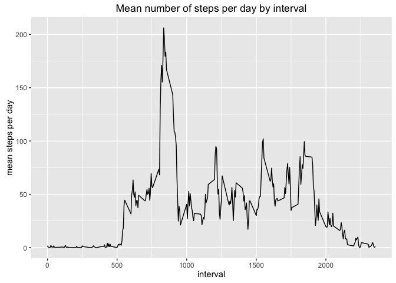

# Reproducible Research: Peer Assessment 1


## Loading and preprocessing the data
I have forked Roger's [GitHub repository](https://github.com/dnrichardson/RepData_PeerAssessment1) and therefore have the data for this assignment read to go. It's currently in a zip file, which we will now decompress.


```r
## Check current working directory
getwd()
```

```
## [1] "/Users/dharma/Coursera/Reproducible_Research/RepData_PeerAssessment1"
```

```r
## List the files
list.files()
```

```
##  [1] "activity.csv"                  "activity.zip"                 
##  [3] "doc"                           "instructions_fig"             
##  [5] "PA1_template_files"            "PA1_template.html"            
##  [7] "PA1_template.md"               "PA1_template.Rmd"             
##  [9] "PeerAssignment1_files"         "PeerAssignment1.html"         
## [11] "PeerAssignment1.md"            "PeerAssignment1.Rmd"          
## [13] "README.md"                     "RepData_PeerAssessment1.Rproj"
```

```r
## Unzip the activity.zip file
unzip("activity.zip")
```

Now, let's read in the data. But first, let's check what the first 2 lines look like. 


```r
## Read the first couple of lines
readLines(con = file("activity.csv", "r"), n = 2)
```

```
## [1] "\"steps\",\"date\",\"interval\"" "NA,\"2012-10-01\",0"
```


```r
## File looks good and has a header. Read it in and specify the column classes
activity <- read.csv("activity.csv", header = TRUE, stringsAsFactors = FALSE, 
                     colClasses = c("integer", "Date", "integer"))
## Check the first lines
head(activity)
```

```
##   steps       date interval
## 1    NA 2012-10-01        0
## 2    NA 2012-10-01        5
## 3    NA 2012-10-01       10
## 4    NA 2012-10-01       15
## 5    NA 2012-10-01       20
## 6    NA 2012-10-01       25
```

```r
## Check the last lines
tail(activity)
```

```
##       steps       date interval
## 17563    NA 2012-11-30     2330
## 17564    NA 2012-11-30     2335
## 17565    NA 2012-11-30     2340
## 17566    NA 2012-11-30     2345
## 17567    NA 2012-11-30     2350
## 17568    NA 2012-11-30     2355
```

Looks like there are a lot of NAs in the steps variable. Let's quickly check if we actually have step data


```r
sum(activity$steps, na.rm = TRUE)
```

```
## [1] 570608
```

Okay, looks good. Let's proceed. At this point I am going to load up dplyr and convert the activty 
dataframe to a tibble. 


```r
require(dplyr, quietly = TRUE, warn.conflicts = FALSE)

activity <- tbl_df(activity)
```


## What is mean total number of steps taken per day?

```r
## Try with tapply

tapply(activity$steps, activity$date, mean, na.rm = TRUE)
```

```
## 2012-10-01 2012-10-02 2012-10-03 2012-10-04 2012-10-05 2012-10-06 
##        NaN  0.4375000 39.4166667 42.0694444 46.1597222 53.5416667 
## 2012-10-07 2012-10-08 2012-10-09 2012-10-10 2012-10-11 2012-10-12 
## 38.2465278        NaN 44.4826389 34.3750000 35.7777778 60.3541667 
## 2012-10-13 2012-10-14 2012-10-15 2012-10-16 2012-10-17 2012-10-18 
## 43.1458333 52.4236111 35.2048611 52.3750000 46.7083333 34.9166667 
## 2012-10-19 2012-10-20 2012-10-21 2012-10-22 2012-10-23 2012-10-24 
## 41.0729167 36.0937500 30.6284722 46.7361111 30.9652778 29.0104167 
## 2012-10-25 2012-10-26 2012-10-27 2012-10-28 2012-10-29 2012-10-30 
##  8.6527778 23.5347222 35.1354167 39.7847222 17.4236111 34.0937500 
## 2012-10-31 2012-11-01 2012-11-02 2012-11-03 2012-11-04 2012-11-05 
## 53.5208333        NaN 36.8055556 36.7048611        NaN 36.2465278 
## 2012-11-06 2012-11-07 2012-11-08 2012-11-09 2012-11-10 2012-11-11 
## 28.9375000 44.7326389 11.1770833        NaN        NaN 43.7777778 
## 2012-11-12 2012-11-13 2012-11-14 2012-11-15 2012-11-16 2012-11-17 
## 37.3784722 25.4722222        NaN  0.1423611 18.8923611 49.7881944 
## 2012-11-18 2012-11-19 2012-11-20 2012-11-21 2012-11-22 2012-11-23 
## 52.4652778 30.6979167 15.5277778 44.3993056 70.9270833 73.5902778 
## 2012-11-24 2012-11-25 2012-11-26 2012-11-27 2012-11-28 2012-11-29 
## 50.2708333 41.0902778 38.7569444 47.3819444 35.3576389 24.4687500 
## 2012-11-30 
##        NaN
```

Ok. Mean steps per day are very low. This could mean we have a couch potato, or that the means are 
not a great reflection of daily activity. Let's do the median steps per day.


```r
tapply(activity$steps, activity$date, median, na.rm = TRUE)
```

```
## 2012-10-01 2012-10-02 2012-10-03 2012-10-04 2012-10-05 2012-10-06 
##         NA          0          0          0          0          0 
## 2012-10-07 2012-10-08 2012-10-09 2012-10-10 2012-10-11 2012-10-12 
##          0         NA          0          0          0          0 
## 2012-10-13 2012-10-14 2012-10-15 2012-10-16 2012-10-17 2012-10-18 
##          0          0          0          0          0          0 
## 2012-10-19 2012-10-20 2012-10-21 2012-10-22 2012-10-23 2012-10-24 
##          0          0          0          0          0          0 
## 2012-10-25 2012-10-26 2012-10-27 2012-10-28 2012-10-29 2012-10-30 
##          0          0          0          0          0          0 
## 2012-10-31 2012-11-01 2012-11-02 2012-11-03 2012-11-04 2012-11-05 
##          0         NA          0          0         NA          0 
## 2012-11-06 2012-11-07 2012-11-08 2012-11-09 2012-11-10 2012-11-11 
##          0          0          0         NA         NA          0 
## 2012-11-12 2012-11-13 2012-11-14 2012-11-15 2012-11-16 2012-11-17 
##          0          0         NA          0          0          0 
## 2012-11-18 2012-11-19 2012-11-20 2012-11-21 2012-11-22 2012-11-23 
##          0          0          0          0          0          0 
## 2012-11-24 2012-11-25 2012-11-26 2012-11-27 2012-11-28 2012-11-29 
##          0          0          0          0          0          0 
## 2012-11-30 
##         NA
```

Wow. The median steps per day are ZERO! That doesn't seem very helpful. 

The means and medians output like this are a bit difficult to apprehend. Now, let's create a histogram of the total 
number of steps taken each day. We will use ggplot2. 


```r
## load ggplot2
require(ggplot2, quietly = TRUE)
require(scales, quietly = TRUE)

## Calculate total steps per day and convert to data frame
totSteps <- as.data.frame.table(tapply(activity$steps, activity$date, sum, na.rm = TRUE))

## Reconvert the date column to the class Date; note that the date variable was renamed to "Var1"
## by the as.data.frame.table function above
totSteps$Var1 <- as.Date(totSteps$Var1)

## Plot the histogram
ggplot(data = totSteps, aes(x = Var1)) + geom_histogram(aes(weights = Freq), binwidth = 1,
                                                        alpha = 0.5) + theme_bw() +
        labs(title = "Histogram of total steps per day") +
        labs(x = "Day", y = "Total number of Steps")
```

<!-- -->

Alright, that looks fairly okay. I can live with this histogram and it took me suprisingly long to 
figure out how to plot it!


## What is the average daily activity pattern?
Make a time series plot (i.e. 𝚝𝚢𝚙𝚎 = "𝚕") of the 5-minute interval (x-axis) and the average number of steps taken, averaged across all days (y-axis)

This will require me to calulate the average number of steps taken across all days for each interval. 


```r
## Use tapply again
meanStepsbyIntervals <- as.data.frame.table(tapply(activity$steps, activity$interval, mean, na.rm = TRUE)) %>%
        dplyr::rename(interval = Var1, mean = Freq)

## Check first lines
head(meanStepsbyIntervals)
```

```
##   interval      mean
## 1        0 1.7169811
## 2        5 0.3396226
## 3       10 0.1320755
## 4       15 0.1509434
## 5       20 0.0754717
## 6       25 2.0943396
```

Double check that I indeed calculated the mean for each interval. Check intervals 0 and 5 with dplyr:


```r
mean(filter(activity, interval == 0)$steps, na.rm = TRUE)
```

```
## [1] 1.716981
```

```r
mean(filter(activity, interval == 5)$steps, na.rm = TRUE)
```

```
## [1] 0.3396226
```

Yep, this all checks out. Let's move onto the time series plot, again using ggplot2.


```r
## Interval on the x axis and average steps taken on the y

ggplot(data = meanStepsbyIntervals, aes(x = interval, y = mean, group = 1)) + geom_line(na.rm = TRUE) +
        theme(axis.text.x = element_text(angle = 90, hjust = 1), text = element_text(size = 10))
```

<!-- -->

Hmm.. ggplot2 is not producing what I want. The x-axis labels are **not cool**. I am going to try with plotly.


```r
require(plotly, quietly = TRUE, warn.conflicts = FALSE)

xaxis <- list(title = "Interval",
              tickangle = 45
              )

p <- plot_ly(meanStepsbyIntervals, x = ~interval, y = ~mean, type = "scatter", mode = "lines") %>%
        layout(title = "Mean steps per day across all days according to Interval", xaxis = xaxis)
f <- plotly_POST(p)
```

```
## No encoding supplied: defaulting to UTF-8.
```

```
## High five! You successfuly sent some data to your account on plotly. View your plot in your browser at https://plot.ly/~drichardson/0 or inside your plot.ly account where it is named 'Mean steps per day across all days according to Interval'FALSE
```

```
## Success! Modified your plotly here -> https://plot.ly/~drichardson/0
```

```r
f
```

<iframe src="https://plot.ly/~drichardson/0.embed" width="800" height="600" id="igraph" scrolling="no" seamless="seamless" frameBorder="0"> </iframe>


Ahh, that is SOOO much better (and interactive, too)!

Now, onto the question of: 
Which 5-minute interval, on average across all the days in the dataset, contains the maximum number of steps?

From the graph above, the answer to this question is **interval 835, which has roughly 206 average steps**. 

## Imputing missing values


## Are there differences in activity patterns between weekdays and weekends?
