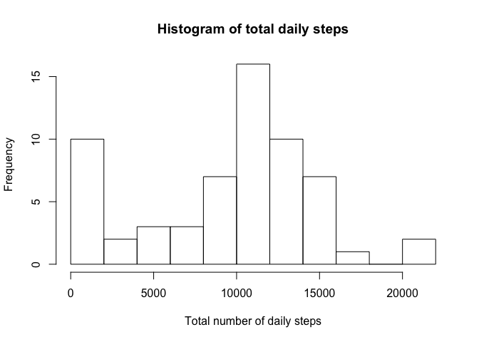

# Reproducible Research: Peer Assessment 1


## Loading and preprocessing the data
I have forked Roger's [GitHub repository](https://github.com/dnrichardson/RepData_PeerAssessment1) and therefore have the data for this assignment read to go. It's currently in a zip file, which we will now decompress.


```r
## Check current working directory
getwd()
```

```
## [1] "/Users/dharma/Coursera/Reproducible_Research/RepData_PeerAssessment1"
```

```r
## List the files
list.files()
```

```
##  [1] "activity.csv"                  "activity.zip"                 
##  [3] "doc"                           "instructions_fig"             
##  [5] "PA1_template_files"            "PA1_template.html"            
##  [7] "PA1_template.md"               "PA1_template.Rmd"             
##  [9] "PeerAssignment1_files"         "PeerAssignment1.html"         
## [11] "PeerAssignment1.md"            "PeerAssignment1.Rmd"          
## [13] "README.md"                     "RepData_PeerAssessment1.Rproj"
```

```r
## Unzip the activity.zip file
unzip("activity.zip")
```

Now, let's read in the data. But first, let's check what the first 2 lines look like. 


```r
## Read the first couple of lines
readLines(con = file("activity.csv", "r"), n = 2)
```

```
## [1] "\"steps\",\"date\",\"interval\"" "NA,\"2012-10-01\",0"
```


```r
## File looks good and has a header. Read it in and specify the column classes
activity <- read.csv("activity.csv", header = TRUE, stringsAsFactors = FALSE, 
                     colClasses = c("integer", "Date", "integer"))
## Check the first lines
head(activity)
```

```
##   steps       date interval
## 1    NA 2012-10-01        0
## 2    NA 2012-10-01        5
## 3    NA 2012-10-01       10
## 4    NA 2012-10-01       15
## 5    NA 2012-10-01       20
## 6    NA 2012-10-01       25
```

```r
## Check the last lines
tail(activity)
```

```
##       steps       date interval
## 17563    NA 2012-11-30     2330
## 17564    NA 2012-11-30     2335
## 17565    NA 2012-11-30     2340
## 17566    NA 2012-11-30     2345
## 17567    NA 2012-11-30     2350
## 17568    NA 2012-11-30     2355
```

Looks like there are a lot of NAs in the steps variable. Let's quickly check if we actually have step data


```r
sum(activity$steps, na.rm = TRUE)
```

```
## [1] 570608
```

Okay, looks good. Let's proceed. At this point I am going to load up dplyr and convert the activty 
dataframe to a tibble. 


```r
require(dplyr, quietly = TRUE, warn.conflicts = FALSE)

activity <- tbl_df(activity)
```


## What is mean total number of steps taken per day?

```r
## Try with tapply

tapply(activity$steps, activity$date, mean, na.rm = TRUE)
```

```
## 2012-10-01 2012-10-02 2012-10-03 2012-10-04 2012-10-05 2012-10-06 
##        NaN  0.4375000 39.4166667 42.0694444 46.1597222 53.5416667 
## 2012-10-07 2012-10-08 2012-10-09 2012-10-10 2012-10-11 2012-10-12 
## 38.2465278        NaN 44.4826389 34.3750000 35.7777778 60.3541667 
## 2012-10-13 2012-10-14 2012-10-15 2012-10-16 2012-10-17 2012-10-18 
## 43.1458333 52.4236111 35.2048611 52.3750000 46.7083333 34.9166667 
## 2012-10-19 2012-10-20 2012-10-21 2012-10-22 2012-10-23 2012-10-24 
## 41.0729167 36.0937500 30.6284722 46.7361111 30.9652778 29.0104167 
## 2012-10-25 2012-10-26 2012-10-27 2012-10-28 2012-10-29 2012-10-30 
##  8.6527778 23.5347222 35.1354167 39.7847222 17.4236111 34.0937500 
## 2012-10-31 2012-11-01 2012-11-02 2012-11-03 2012-11-04 2012-11-05 
## 53.5208333        NaN 36.8055556 36.7048611        NaN 36.2465278 
## 2012-11-06 2012-11-07 2012-11-08 2012-11-09 2012-11-10 2012-11-11 
## 28.9375000 44.7326389 11.1770833        NaN        NaN 43.7777778 
## 2012-11-12 2012-11-13 2012-11-14 2012-11-15 2012-11-16 2012-11-17 
## 37.3784722 25.4722222        NaN  0.1423611 18.8923611 49.7881944 
## 2012-11-18 2012-11-19 2012-11-20 2012-11-21 2012-11-22 2012-11-23 
## 52.4652778 30.6979167 15.5277778 44.3993056 70.9270833 73.5902778 
## 2012-11-24 2012-11-25 2012-11-26 2012-11-27 2012-11-28 2012-11-29 
## 50.2708333 41.0902778 38.7569444 47.3819444 35.3576389 24.4687500 
## 2012-11-30 
##        NaN
```

Ok. Mean steps per day are very low. This could mean we have a couch potato, or that the means are 
not a great reflection of daily activity. Let's do the median steps per day.


```r
tapply(activity$steps, activity$date, median, na.rm = TRUE)
```

```
## 2012-10-01 2012-10-02 2012-10-03 2012-10-04 2012-10-05 2012-10-06 
##         NA          0          0          0          0          0 
## 2012-10-07 2012-10-08 2012-10-09 2012-10-10 2012-10-11 2012-10-12 
##          0         NA          0          0          0          0 
## 2012-10-13 2012-10-14 2012-10-15 2012-10-16 2012-10-17 2012-10-18 
##          0          0          0          0          0          0 
## 2012-10-19 2012-10-20 2012-10-21 2012-10-22 2012-10-23 2012-10-24 
##          0          0          0          0          0          0 
## 2012-10-25 2012-10-26 2012-10-27 2012-10-28 2012-10-29 2012-10-30 
##          0          0          0          0          0          0 
## 2012-10-31 2012-11-01 2012-11-02 2012-11-03 2012-11-04 2012-11-05 
##          0         NA          0          0         NA          0 
## 2012-11-06 2012-11-07 2012-11-08 2012-11-09 2012-11-10 2012-11-11 
##          0          0          0         NA         NA          0 
## 2012-11-12 2012-11-13 2012-11-14 2012-11-15 2012-11-16 2012-11-17 
##          0          0         NA          0          0          0 
## 2012-11-18 2012-11-19 2012-11-20 2012-11-21 2012-11-22 2012-11-23 
##          0          0          0          0          0          0 
## 2012-11-24 2012-11-25 2012-11-26 2012-11-27 2012-11-28 2012-11-29 
##          0          0          0          0          0          0 
## 2012-11-30 
##         NA
```

Wow. The median steps per day are ZERO! That doesn't seem very helpful. 

The means and medians output like this are a bit difficult to apprehend. Now, let's create a histogram of the total 
number of steps taken each day. We will use ggplot2. 


```r
## load ggplot2
require(ggplot2, quietly = TRUE)
require(scales, quietly = TRUE)

## Calculate total steps per day and convert to data frame
totSteps <- as.data.frame.table(tapply(activity$steps, activity$date, sum, na.rm = TRUE))

## Reconvert the date column to the class Date; note that the date variable was renamed to "Var1"
## by the as.data.frame.table function above
totSteps$Var1 <- as.Date(totSteps$Var1)

## Plot the histogram
ggplot(data = totSteps, aes(x = Var1)) + geom_histogram(aes(weights = Freq), binwidth = 1,
                                                        alpha = 0.5) + theme_bw() +
        labs(title = "Histogram of total steps per day") +
        labs(x = "Day", y = "Total number of Steps")
```

<!-- -->

Alright, that looks fairly okay. I can live with this histogram and it took me suprisingly long to 
figure out how to plot it!


## What is the average daily activity pattern?
Make a time series plot (i.e. 𝚝𝚢𝚙𝚎 = "𝚕") of the 5-minute interval (x-axis) and the average number of steps taken, averaged across all days (y-axis)

This will require me to calulate the average number of steps taken across all days for each interval. 


```r
## Use tapply again
meanStepsbyIntervals <- as.data.frame.table(tapply(activity$steps, activity$interval, mean, na.rm = TRUE)) %>%
        dplyr::rename(interval = Var1, mean = Freq)

## Check first lines
head(meanStepsbyIntervals)
```

```
##   interval      mean
## 1        0 1.7169811
## 2        5 0.3396226
## 3       10 0.1320755
## 4       15 0.1509434
## 5       20 0.0754717
## 6       25 2.0943396
```

Double check that I indeed calculated the mean for each interval. Check intervals 0 and 5 with dplyr:


```r
mean(filter(activity, interval == 0)$steps, na.rm = TRUE)
```

```
## [1] 1.716981
```

```r
mean(filter(activity, interval == 5)$steps, na.rm = TRUE)
```

```
## [1] 0.3396226
```

Yep, this all checks out. Let's move onto the time series plot, again using ggplot2.


```r
## Interval on the x axis and average steps taken on the y

ggplot(data = meanStepsbyIntervals, aes(x = interval, y = mean, group = 1)) + geom_line(na.rm = TRUE) +
        theme(axis.text.x = element_text(angle = 90, hjust = 1), text = element_text(size = 10))
```

<!-- -->

Hmm.. ggplot2 is not producing what I want. The x-axis labels are **not cool**. I am going to try with plotly.


```r
require(plotly, quietly = TRUE, warn.conflicts = FALSE)

xaxis <- list(title = "Interval",
              tickangle = 45,
              size = 5
              )

plot_ly(meanStepsbyIntervals, x = ~interval, y = ~mean, type = "scatter", mode = "lines") %>%
        layout(title = "Mean steps per day across all days according to Interval", xaxis = xaxis)
```

<!--html_preserve--><div id="htmlwidget-fc1f704ca75302552dc3" style="width:768px;height:480px;" class="plotly html-widget"></div>
<script type="application/json" data-for="htmlwidget-fc1f704ca75302552dc3">{"x":{"layout":{"margin":{"b":40,"l":60,"t":25,"r":10},"title":"Mean steps per day across all days according to Interval","xaxis":{"domain":[0,1],"title":"Interval","tickangle":45,"size":5,"type":"category","categoryorder":"array","categoryarray":["0","5","10","15","20","25","30","35","40","45","50","55","100","105","110","115","120","125","130","135","140","145","150","155","200","205","210","215","220","225","230","235","240","245","250","255","300","305","310","315","320","325","330","335","340","345","350","355","400","405","410","415","420","425","430","435","440","445","450","455","500","505","510","515","520","525","530","535","540","545","550","555","600","605","610","615","620","625","630","635","640","645","650","655","700","705","710","715","720","725","730","735","740","745","750","755","800","805","810","815","820","825","830","835","840","845","850","855","900","905","910","915","920","925","930","935","940","945","950","955","1000","1005","1010","1015","1020","1025","1030","1035","1040","1045","1050","1055","1100","1105","1110","1115","1120","1125","1130","1135","1140","1145","1150","1155","1200","1205","1210","1215","1220","1225","1230","1235","1240","1245","1250","1255","1300","1305","1310","1315","1320","1325","1330","1335","1340","1345","1350","1355","1400","1405","1410","1415","1420","1425","1430","1435","1440","1445","1450","1455","1500","1505","1510","1515","1520","1525","1530","1535","1540","1545","1550","1555","1600","1605","1610","1615","1620","1625","1630","1635","1640","1645","1650","1655","1700","1705","1710","1715","1720","1725","1730","1735","1740","1745","1750","1755","1800","1805","1810","1815","1820","1825","1830","1835","1840","1845","1850","1855","1900","1905","1910","1915","1920","1925","1930","1935","1940","1945","1950","1955","2000","2005","2010","2015","2020","2025","2030","2035","2040","2045","2050","2055","2100","2105","2110","2115","2120","2125","2130","2135","2140","2145","2150","2155","2200","2205","2210","2215","2220","2225","2230","2235","2240","2245","2250","2255","2300","2305","2310","2315","2320","2325","2330","2335","2340","2345","2350","2355"]},"yaxis":{"domain":[0,1],"title":"mean"}},"config":{"modeBarButtonsToRemove":["sendDataToCloud"]},"base_url":"https://plot.ly","source":"A","data":[{"x":["0","5","10","15","20","25","30","35","40","45","50","55","100","105","110","115","120","125","130","135","140","145","150","155","200","205","210","215","220","225","230","235","240","245","250","255","300","305","310","315","320","325","330","335","340","345","350","355","400","405","410","415","420","425","430","435","440","445","450","455","500","505","510","515","520","525","530","535","540","545","550","555","600","605","610","615","620","625","630","635","640","645","650","655","700","705","710","715","720","725","730","735","740","745","750","755","800","805","810","815","820","825","830","835","840","845","850","855","900","905","910","915","920","925","930","935","940","945","950","955","1000","1005","1010","1015","1020","1025","1030","1035","1040","1045","1050","1055","1100","1105","1110","1115","1120","1125","1130","1135","1140","1145","1150","1155","1200","1205","1210","1215","1220","1225","1230","1235","1240","1245","1250","1255","1300","1305","1310","1315","1320","1325","1330","1335","1340","1345","1350","1355","1400","1405","1410","1415","1420","1425","1430","1435","1440","1445","1450","1455","1500","1505","1510","1515","1520","1525","1530","1535","1540","1545","1550","1555","1600","1605","1610","1615","1620","1625","1630","1635","1640","1645","1650","1655","1700","1705","1710","1715","1720","1725","1730","1735","1740","1745","1750","1755","1800","1805","1810","1815","1820","1825","1830","1835","1840","1845","1850","1855","1900","1905","1910","1915","1920","1925","1930","1935","1940","1945","1950","1955","2000","2005","2010","2015","2020","2025","2030","2035","2040","2045","2050","2055","2100","2105","2110","2115","2120","2125","2130","2135","2140","2145","2150","2155","2200","2205","2210","2215","2220","2225","2230","2235","2240","2245","2250","2255","2300","2305","2310","2315","2320","2325","2330","2335","2340","2345","2350","2355"],"y":[1.71698113207547,0.339622641509434,0.132075471698113,0.150943396226415,0.0754716981132075,2.09433962264151,0.528301886792453,0.867924528301887,0,1.47169811320755,0.30188679245283,0.132075471698113,0.320754716981132,0.679245283018868,0.150943396226415,0.339622641509434,0,1.11320754716981,1.83018867924528,0.169811320754717,0.169811320754717,0.377358490566038,0.264150943396226,0,0,0,1.13207547169811,0,0,0.132075471698113,0,0.226415094339623,0,0,1.54716981132075,0.943396226415094,0,0,0,0,0.207547169811321,0.622641509433962,1.62264150943396,0.584905660377358,0.490566037735849,0.0754716981132075,0,0,1.18867924528302,0.943396226415094,2.56603773584906,0,0.339622641509434,0.358490566037736,4.11320754716981,0.660377358490566,3.49056603773585,0.830188679245283,3.11320754716981,1.11320754716981,0,1.56603773584906,3,2.24528301886792,3.32075471698113,2.9622641509434,2.09433962264151,6.05660377358491,16.0188679245283,18.3396226415094,39.4528301886792,44.4905660377358,31.4905660377358,49.2641509433962,53.7735849056604,63.4528301886792,49.9622641509434,47.0754716981132,52.1509433962264,39.3396226415094,44.0188679245283,44.1698113207547,37.3584905660377,49.0377358490566,43.811320754717,44.377358490566,50.5094339622642,54.5094339622642,49.9245283018868,50.9811320754717,55.6792452830189,44.3207547169811,52.2641509433962,69.5471698113208,57.8490566037736,56.1509433962264,73.377358490566,68.2075471698113,129.433962264151,157.528301886792,171.150943396226,155.396226415094,177.301886792453,206.169811320755,195.924528301887,179.566037735849,183.396226415094,167.018867924528,143.452830188679,124.037735849057,109.11320754717,108.11320754717,103.716981132075,95.9622641509434,66.2075471698113,45.2264150943396,24.7924528301887,38.7547169811321,34.9811320754717,21.0566037735849,40.5660377358491,26.9811320754717,42.4150943396226,52.6603773584906,38.9245283018868,50.7924528301887,44.2830188679245,37.4150943396226,34.6981132075472,28.3396226415094,25.0943396226415,31.9433962264151,31.3584905660377,29.6792452830189,21.3207547169811,25.5471698113208,28.377358490566,26.4716981132075,33.4339622641509,49.9811320754717,42.0377358490566,44.6037735849057,46.0377358490566,59.188679245283,63.8679245283019,87.6981132075472,94.8490566037736,92.7735849056604,63.3962264150943,50.1698113207547,54.4716981132075,32.4150943396226,26.5283018867925,37.7358490566038,45.0566037735849,67.2830188679245,42.3396226415094,39.8867924528302,43.2641509433962,40.9811320754717,46.2452830188679,56.4339622641509,42.7547169811321,25.1320754716981,39.9622641509434,53.5471698113208,47.3207547169811,60.811320754717,55.7547169811321,51.9622641509434,43.5849056603774,48.6981132075472,35.4716981132075,37.5471698113208,41.8490566037736,27.5094339622642,17.1132075471698,26.0754716981132,43.622641509434,43.7735849056604,30.0188679245283,36.0754716981132,35.4905660377358,38.8490566037736,45.9622641509434,47.7547169811321,48.1320754716981,65.3207547169811,82.9056603773585,98.6603773584906,102.11320754717,83.9622641509434,62.1320754716981,64.1320754716981,74.5471698113208,63.1698113207547,56.9056603773585,59.7735849056604,43.8679245283019,38.5660377358491,44.6603773584906,45.4528301886792,46.2075471698113,43.6792452830189,46.622641509434,56.3018867924528,50.7169811320755,61.2264150943396,72.7169811320755,78.9433962264151,68.9433962264151,59.6603773584906,75.0943396226415,56.5094339622642,34.7735849056604,37.4528301886792,40.6792452830189,58.0188679245283,74.6981132075472,85.3207547169811,59.2641509433962,67.7735849056604,77.6981132075472,74.2452830188679,85.3396226415094,99.4528301886792,86.5849056603774,85.6037735849057,84.8679245283019,77.8301886792453,58.0377358490566,53.3584905660377,36.3207547169811,20.7169811320755,27.3962264150943,40.0188679245283,30.2075471698113,25.5471698113208,45.6603773584906,33.5283018867925,19.622641509434,19.0188679245283,19.3396226415094,33.3396226415094,26.811320754717,21.1698113207547,27.3018867924528,21.3396226415094,19.5471698113208,21.3207547169811,32.3018867924528,20.1509433962264,15.9433962264151,17.2264150943396,23.4528301886792,19.2452830188679,12.4528301886792,8.0188679245283,14.6603773584906,16.3018867924528,8.67924528301887,7.79245283018868,8.13207547169811,2.62264150943396,1.45283018867925,3.67924528301887,4.81132075471698,8.50943396226415,7.07547169811321,8.69811320754717,9.75471698113208,2.20754716981132,0.320754716981132,0.113207547169811,1.60377358490566,4.60377358490566,3.30188679245283,2.84905660377358,0,0.830188679245283,0.962264150943396,1.58490566037736,2.60377358490566,4.69811320754717,3.30188679245283,0.641509433962264,0.226415094339623,1.07547169811321],"mode":"lines","type":"scatter","line":{"fillcolor":"rgba(31,119,180,1)","color":"rgba(31,119,180,1)"},"xaxis":"x","yaxis":"y"}]},"evals":[],"jsHooks":[]}</script><!--/html_preserve-->


Ahh, that is SOOO much better (and interactive, too)!

Now, onto the question of: 
Which 5-minute interval, on average across all the days in the dataset, contains the maximum number of steps?

From the graph above, the answer to this question is **interval 835, which has roughly 206 average steps**. 

## Imputing missing values


## Are there differences in activity patterns between weekdays and weekends?
